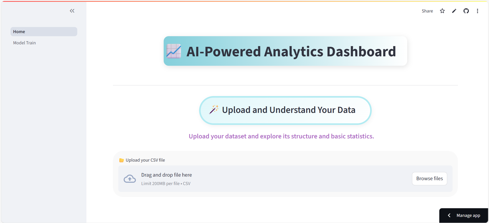
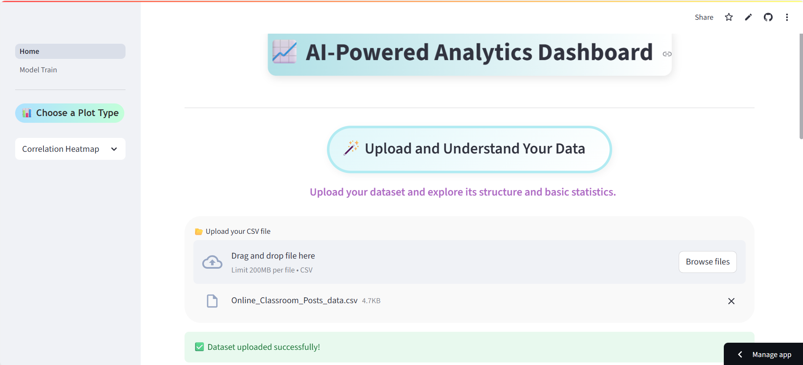
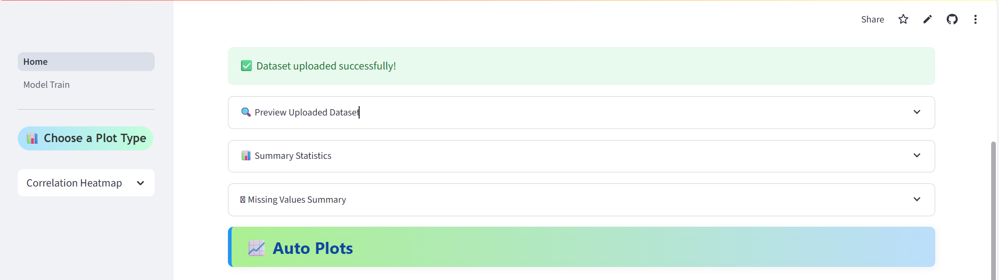
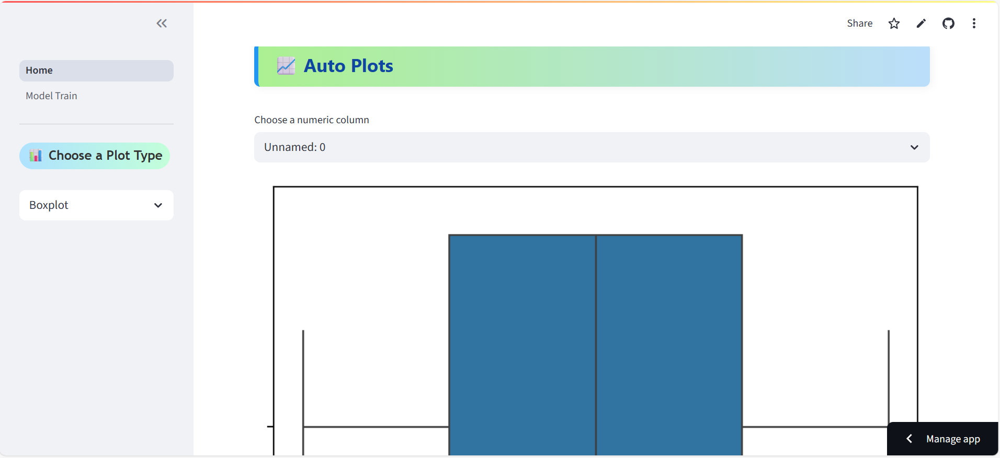
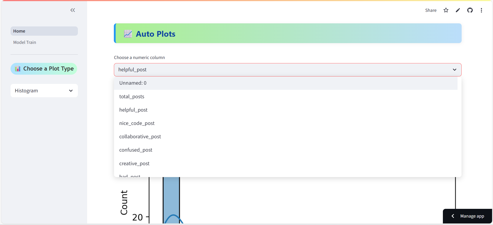
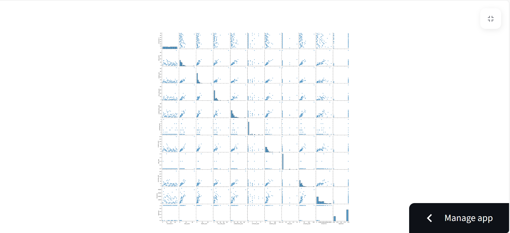
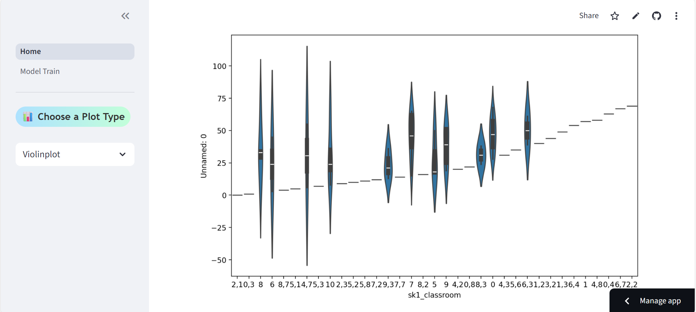
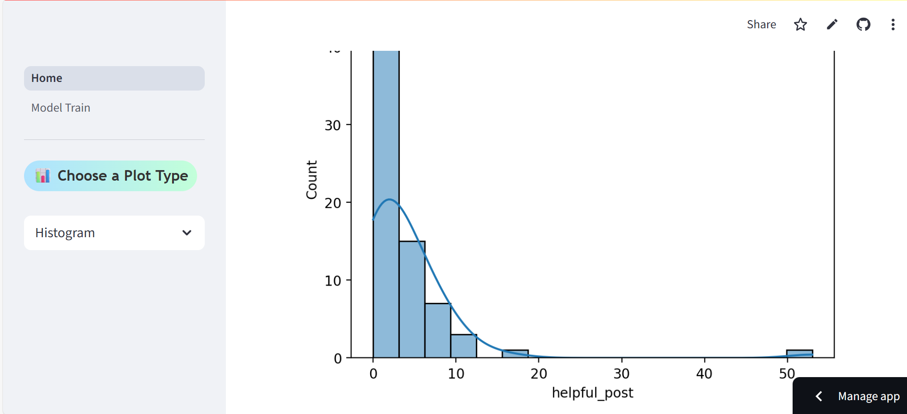
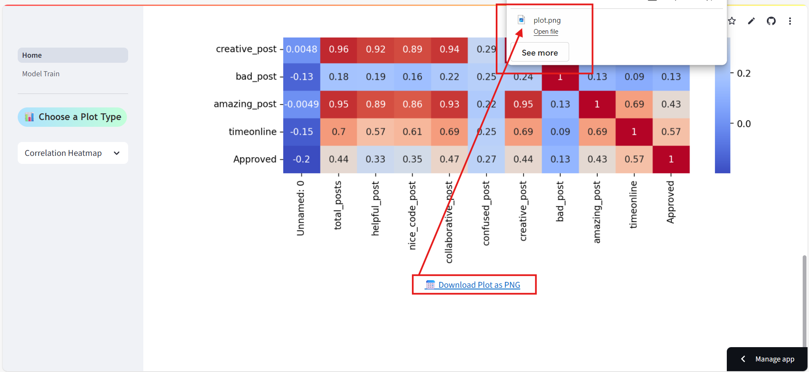
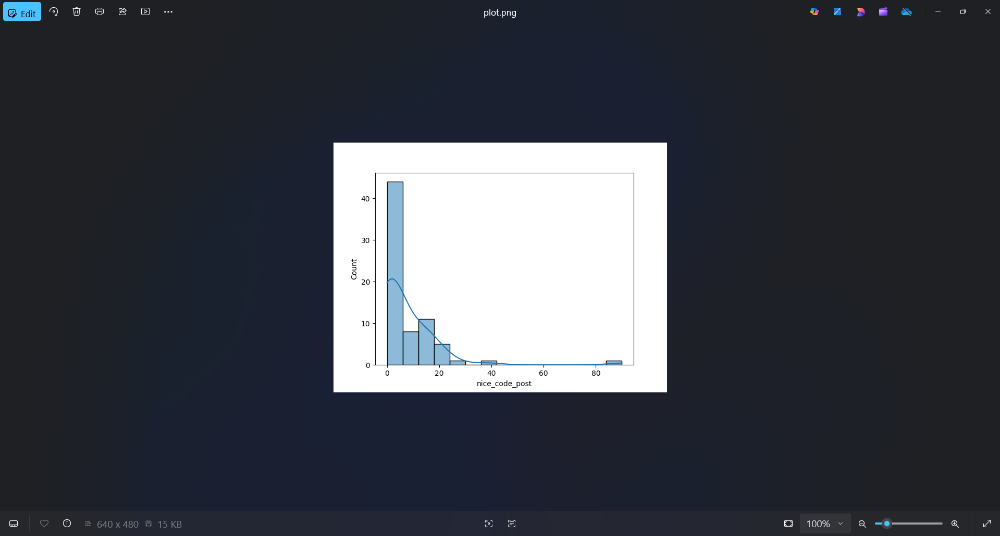

# 📈 AI-Powered Analytics Dashboard

---

## 🚀 Overview

**AI-Powered Analytics Dashboard** is a user-friendly web application built with **Streamlit** that allows users to upload, explore, and visualize their datasets interactively. With built-in charting options and beautifully styled UI elements, it makes data analysis intuitive and visually appealing — no coding required.

🧠 Future versions will support AI-powered insights and automatic ML model training & prediction.

---

## 🌐 Live Demo

👉 [Launch the App Now](https://ai-dashboard-nhrnaykxzfn2rxcpf6pqgg.streamlit.app/)

---

## ✨ Features

- 📂 Upload CSV files and preview the dataset
- 📊 Interactive visualizations:
  - Histogram
  - Boxplot
  - Countplot
  - Correlation Heatmap
  - Missing Values Heatmap
  - Pairplot
  - Violinplot
- 📌 Summary Statistics and Null Value Analysis
- 🎨 Customized UI with hover effects, gradients, shadows, and styled headers
- 💾 Download plots as images (PNG)
- 🔮 Coming Soon: ML model training, predictions, and AI-generated insights

---

## 🖼️ Screenshots

---

## 🛠️ Tech Stack

| Tool/Library     | Purpose                              |
|------------------|--------------------------------------|
| Streamlit        | Web App Framework                    |
| pandas           | Data Handling                        |
| seaborn/matplotlib | Visualization Libraries            |
| plotly           | Interactive Charts                   |
| base64/io        | Image Conversion and Downloads       |
| HTML/CSS         | Custom Styling and Layout            |

---

## 📁 Folder Structure
├── .streamlit/
│ └── config.toml # Optional theming configs

├── pages/
│ ├── 1_Auto_Plots.py # Additional visualization pages
│ ├── 2_Model_Train.py # (Planned) ML Training Module
├── Home.py # Main dashboard file
├── requirements.txt # Python dependencies
├── README.md # Project documentation
